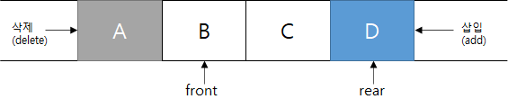

# 4강. 큐

## 1. 큐의 개념

<aside>
⭐ **가장 먼저 대기 줄에 들어간 작업이 가장 처음에 처리되는 작업 (First-In-First-Out)
한 쪽에서 삭제, 다른 한 쪽에서 삽입 연산이 발생한다.**

</aside>

queue 의 자료 입출력

## 2. 큐의 추상 자료형

1. Queue Create_q(maxQueueSize)
    
    큐의 크기가 maxStackSize인 빈 큐를 생성하고 반환한다.
    
2. Boolean IsFull_q(queue, maxQueueSize)
    
    큐에 저장되어있 자료의 갯수를 파악하여 저장공간이 남아 있는지 확인한다.
    
3. Queue Add_q(queue, item)
    
    큐에 저장공간이 있다면 rear 영역에 item을 삽입한다.
    
4. Boolean IsEmpty_q(queue)
    
    큐의 front 포인터와 rear 포인터가 같은 주소를 가르키고 있는지 확인한다.
    
5. Element Delete_q(queue)
    
    큐가 비어있는지 확인한 뒤 비어있지 않다면 front 영역의 데이터를 삭제하고 반환한다.
    

## 3. 큐의 응용

### CPU의 스케줄링 기법

- FCFS(First-Come First-Served)
    
    준비 큐에 도착한 프로세스 순서대로 CPU를 할당받도록 해주는 기법
    
- RR(Round Robin)
    
    흔히 대화형 시스템에 사용됨. 작업이 도착한 순서대로 할당되긴 하지만, CPU의 시간 할당량 또는 시간 간격에 의해 제한을 받고 그 시간안에 작업이 완료되지 못하면 큐의 맨 뒤로 다시 배치함.
    

FCFS 스케줄링 기법 알고리즘의 예

RR 스케줄링 기법 알고리즘의 예