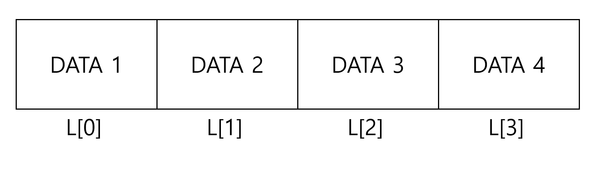

# 5장. 연결 리스트

### EX) C언어 프로그램 실행 중 구조체 메모리 할당

```c
int a, *p_a;
float b, *p_b;
p_a = (int*)malloc(sizeof(int));
p_b = (float*)malloc(sizeof(float));
*p_a = 10;
```

## 1. 리스트의 개념

<aside>
❗ **논리적인 순서에 의해 결정된 원소들의 나열
→ 물리적인 순서와 무관하게 논리적인 순서만 유지**

</aside>

## 2. 배열을 이용한 리스트 구현



배열을 이용하여 리스트를 구현한 자료형


배열로 구성한 리스트 중간 인덱스에 자료가 삽입되는 경우

> 배열을 이용하여 리스트를 구현하면, 논리적인 순서와 함께 물리적인 순서 또한 일정하게 유지 된다. 이로 인해 중간에 데이터를 삽입이나 삭제하는 경우가 생긴다면 뒤의 인덱스 자료형들의 물리적 공간이 모두 변경되어야 하므로 시간이 오래걸린다. 또한 메모리 할당량에 변화가 생길수도 있으므로 권장되지 않는다.
> 

## 3.  포인터를 이용한 리스트 구현


포인터를 이용한 리스트 표현

> 데이터의 값과 주소(포인터)를 이용한 리스트 구현을 연결리스트라고 하며 연결리스트의 구성 단위는 노드(데이터와 주소) 로 이루어져 있다. 연결리스트의 노드간 연결은 포인터의 연결로 구현된다. 마지막 노드를 제외한 나머지 모든 노드의 링크는 논리적으로 다음에 위치할 노드의 주소를 가리킨다. 마지막 노드의 링크는 널 포인터(null pointer) 로 표현한다.
> 

## 4. 연결 리스트에서 노드의 삽입과 삭제

연결리스트에서의 대표적 연산은 삽입과 삭제이다. 연결리스트는 조회 및 검색 에서의 효율은 일반 리스트보다 떨어진다 (순차 조회해야 하기 때문). 하지만 삽입과 삭제에서 유리한데 연결리스트는 데이터의 물리적인 주소값과 데이터의 논리적인 순서가 일치할 필요가 없기 때문에 **데이터가 바라보는 노드의 주소값만 변경하면 되기 때문**이다.  

### 4-1. 노드의 삽입


삽입과 삭제 연산 전 연결리스트 

삽입 연산은 노드가 바라보던 주소를 끊고 새로운 노드가 끼어드는 형태로 이루어진다.


데이터 A 의 노드와 데이터 C 사이의 노드 사이에 삽입 연산이 일어난 상황

### 4-2. 노드의 삭제

삭제 연산은 특정 노드의 메모리를 할당 해제하고 노드 사이의 링크를 삭제할 노드의 다음 노드의 주소로 연결한다.


Head 노드가 바라보는 데이터 A 삭제 연산이 일어난 상황

## 5. 연결리스트의 추상 자료형

1. LinkedList create_linkedList()
연결리스트 객체 생성
2. LinkedList add(data)
연결리스트의 가장 마지막 노드에 새로운 데이터를 추가한다.
3. LinkedList insert(data)
연결리스트의 특정 인덱스 번호 뒤에 데이터를 삽입한다.
4. data [](index)
-연결리스트의 특정 인덱스의 값을 반환한다.

**편의상 연결리스트 내 데이터에 중복은 없다고 가정한다.**