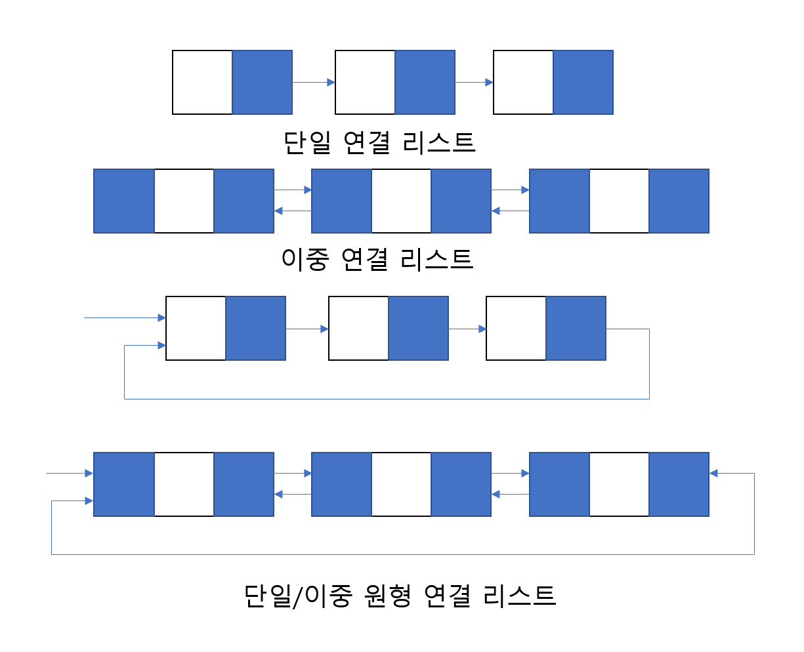

# 6장. 연결리스트의 응용

## 연결 리스트의 변형

- 연결 리스트 종류
    - 단일 연결 리스트
    - 이중 연결 리스트
    - 단일/이중 원형 연결 리스트
    
- 단일 연결 리스트
    
    헤드부터 순차적으로 검색
    
- 이중 연결 리스트
    
    특정 노드의 선행 노드에 접근하기 용이하도록 개선
    
- 원형 연결 리스트
    
    꼬리 노드의 링크가 항상 Null 인 것을 개선하여 처음으로 돌아갈 수 있도록 개선 (검색성능 향상)
    
- 이중 원형 연결 리스트
    
    이중 연결 리스트와 원형 연결 리스트의 장점을 합친 것으로, 연결리스트 내에서 선행 노드와 후행 노드의 접근이 자유로우며 첫 노드와 마지막 노드를 연결해두어 순환구조로 인덱싱을 한층 더 자유롭게 만든 자료구조 이다.
    

