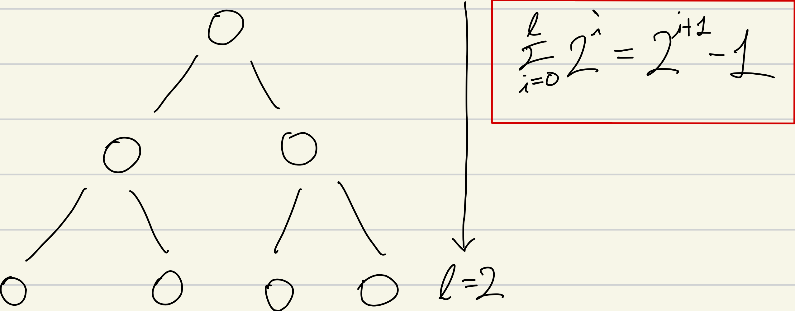
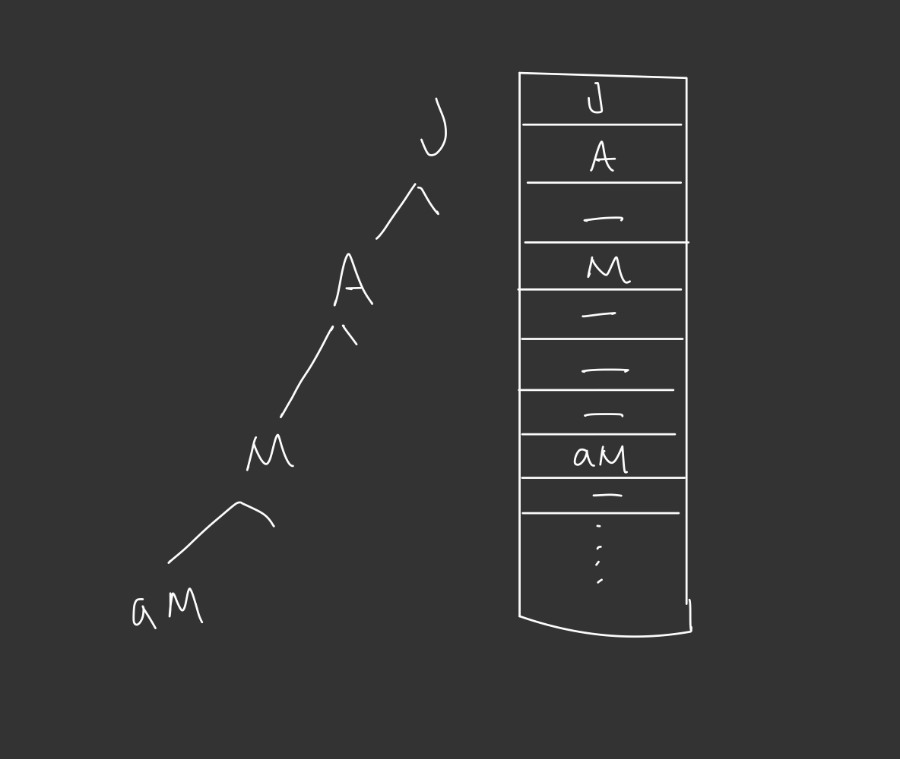

# 7장. 트리
## 1. 트리의 개념

> 트리로 나타낸 트리
 
**계층형 구조 데이터 표현에 적합한 자료구조**<br>
ex1) Tree -> Binary Tree / m-way Tree <br>
ex2) <br>Nodes : `모차르트`, `바흐`, `베토벤`, `세잔`, `피카소`, `아인슈타인`, `뉴턴` 
    <br> Root : 위인 -> 예술가 / 학자 

## 2. 용어

- 노드 (정점)
  - 트리를 구성하는 항목
- 서브트리
  - 특정 노드 하위로 파생되는 새로운 트리 
- 루트노드
  - 부모 노드를 가지지 않는 최상위 노드
- 리프노드
  - 자식 노드를 가지지 않는 최하위 노드
- 진입 차수
  - 노드로 들어오는 선의 개수 
  - 루트노드는 0이며 나머지 노드는 무조건 1이다. 2이상인 경우 그래프가 된다.
- 진출 차수
  - 노드로 부터 나가는 선의 개수 
  - 노드의 차수를 결정한다. (degree of a node)
  - 최대 차수가 트리 전체의 차수가 된다. (degree of a tree)
- 레벨
  - 루트 노드로부터 해당 노드까지 이어진 선의 길이
  
## 3. 트리의 추상자료형 (ADT)
```text
    Tree Create() 
    ::= 트리를 생성하고 루트 노드를 가리키는 포인터를 반환한다.
    
    Destroy(Tree)
    ::= 트리 객체가 점유중인 메모리를 반환한다.
    
    Tree Copy_Tree(Tree) 
    ::= 트리를 복사하고 새로 생성한 트리의 루트 노드를 가리키는 포인터를 반환한다.
    
    Node Insert(n) 
    ::= 트리에 노드 n을 삽입한다.
    
    Delete()
    ::= 트리에서 노드를 삭제한다. 보통 재구성 단계를 포함한다.
    
    Node Root()
    ::= 루트 노드 값을 반환한다.
    
    Node Parent(n)
    ::= 노드 n의 부모 노드를 반환한다. n이 루트노드이면 예외를 반환한다.
    
    List<Node> Children(n)
    ::= 노드 n의 자식 노드들을 반환한다. 노드 n이 리프노드이면 예외를 반환한다.
    
    boolean IsRoot(n)
    ::= 노드 n이 루트노드이면 True, 아니면 False를 반환한다.
    
    boolean IsInternal(n)
    ::= 노드 n이 내부노드이면 True, 아니면 False를 반환한다.
    
    boolean IsLeaf(n)
    ::= 노드 n이 리프노드이면 True, 아니면 False를 반환한다.
    
    boolean IsEmpty(Tree)
    ::= 트리가 비었으면 True, 아니면 False를 반환한다.
    
    Replace(n, m)
    ::= 노드 n을 노드 m으로 교체한다.
    
```

## 4. 이진 트리
### 정의
트리에 속한 모든 노드의 차수가 2 이하인 트리를 이진 트리라고 한다.
- 수학적인 이론 정리가 용이하다.
- 구현하기 간편하다.
- 일반성을 잃지 않고 방향성을 부여하기 좋다. (왼쪽, 오른쪽 노드)

### 포화 이진 트리와 완전 이진 트리
- 포화 이진 트리 (Perfect Binary Tree)
  - 모든 레벨이 허용되는 최대 개수의 노드를 가지는 트리 
  - 
  
- 완전 이진 트리 (Complete Binary Tree)
  - 마지막 레벨을 제외한 모든 레벨이 최대 노드를 가지고 있고, 마지막 레벨에서 **왼쪽부터 채워지고 있는** 트리
  
### 배열을 이용한 이진 트리 구현
트리가 포화 이진 트리 혹은 완전 이진 트리인 경우 낭비되는 공간 없이 효율적인 구현이 가능하지만<br>
단방향으로만 노드를 가진 트리의 경우 메모리 낭비가 심하므로 포인터를 이용하여 구현하는 것이 일반적


## 5. 이진 트리 연산
### 이진 트리 순회
트리의 각 노드를 빠짐없이, 그리고 중복 없이 한 번씩 방문하는 것을 순회 한다고 한다.
- 순회 하는 순서에 따른 구분
  - 전위 순회(PLR)
    - 루트
    - 왼쪽 서브트리 전위 순회
    - 오른쪽 서브트리 전위 순회
  - 중위 순회(LPR)
    - 왼쪽 서브트리 중위 순회
    - 루트
    - 오른쪽 서브트리 중위 순회
  - 후위 순회(LRP)
    - 왼쪽 서브트리 후위 순회
    - 오른쪽 서브트리 후위 순회
    - 루트

