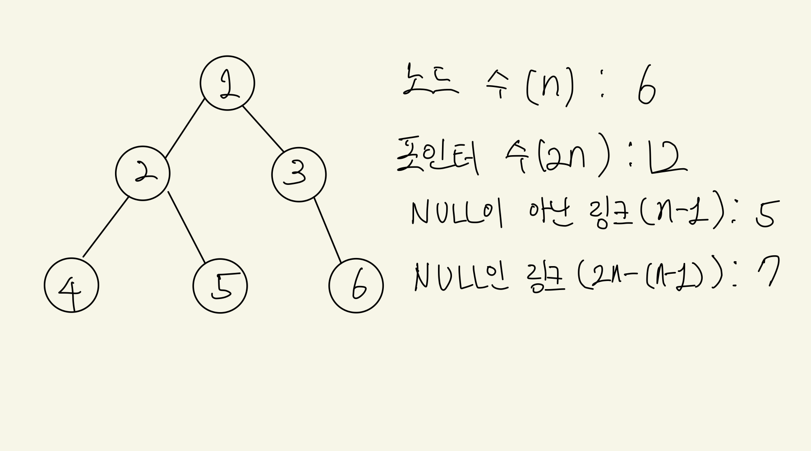

# 스레드 트리
## 1. 스레드 트리의 개념
- 기존의 트리는 순회 시 방문하지 않은 노드들을 재귀스택에 저장하여 관리한다.
  - 해당 방법은 스택을 운영하기 때문에 까다롭고 성능면에서 좋지 않다.
- 남는 노드의 포인터(Null 을 가리키는) 를 이용하여 다음 방문할 장소를 지정한다.
- 탐색에 특화된 트리이지만 삽입과 삭제가 빈번하게 일어나면 연산이 까다롭다.

 

### 남는 노드 구하기

트리의 노드 전체 갯수를 n이라고 할 때
- 포인터의 수는 전체 노드가 왼쪽 오른쪽 한 개씩 가지고 있으므로 2n
- Null이 아닌 링크는 루트를 제외한 모든 노드의 진입차수가 1이므로 n-1
- Null인 링크는 전체 포인터 갯수에서 Null이 아닌 링크를 제외하므로 2n-(n-1) = n+1


## 2. 스레드 트리의 구현

### 2-1. 스레드 저장공간을 별도로 추가하는 방법
> 기존의 트리 노드 구조에 스레드 저장공간을 별도로 추가 한다

기존의 노드 멤버 변수
```python
class Node:
    def __init__(self):
        self.data = None
        self.left = None
        self.right = None
```

스레드 저장공간을 추가한 노드
기존의 노드 멤버 변수
```python
class Node:
    def __init__(self):
        self.data = None
        self.left = None
        self.right = None
        self.left_thread = None
        self.right_thread = None
```

- 위와 같이 저장공간을 추가로 사용하면 구현은 간편하지만 노드당 두개의 포인터 공간을 더 사용하므로 메모리 낭비가 커진다. 

### 2-2. 남는 노드를 이용하여 구현하는 방법
- 위에서 계산한 바와 같이 트리에는 항상 n+1 개의 Null 포인터가 존재하는데, 이를 이용하여 스레드 포인터로 사용한다.
- 단순히 Null 인 포인터에 스레드 링크를 대입하면 순회 시 이것이 실제 자식 노드 주소인지 스레드 링크인지 구별할 수 있는 방법이 없으므로, 별도의 플래그 변수를 두어 확인한다.

남는 노드를 이용하여 스레드 트리를 구현할때 노드 구조
기존의 노드 멤버 변수
```python
class Node:
    def __init__(self):
        self.data = None
        self.left = None
        self.right = None
        self.isFlag = False
```

